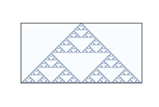

Classifying CAs
---------------

.. _fig_6.2:

   Figure 6.2: Rule 18 after 64 steps.

How many of these CAs are there?

Since each cell is either on or off, we can specify the state of a cell with a single bit. In a neighborhood with three cells, there are 8 possible configurations, so there are 8 entries in the rule tables. And since each entry contains a single bit, we can specify a table using 8 bits. With 8 bits, we can specify 256 different rules.

One of Wolfram’s first experiments with CAs was to test all 256 possibilities and classify them.

Examining the results visually, he proposed that the behavior of CAs can be grouped into four classes. Class 1 contains the simplest (and least interesting) CAs, the ones that evolve from almost any starting condition to the same uniform pattern. As a trivial example, Rule 0 always generates an empty pattern after one time step.

Rule 50 is an example of Class 2. It generates a simple pattern with nested structure, that is, a pattern that contains many smaller versions of itself. Rule 18 makes the nested structure is even clearer; :ref:`Figure 6.2<fig_6.2>` shows what it looks like after 64 steps.

This pattern resembles the Sierpiński triangle, which you can read about at http://thinkcomplex.com/sier.

Some Class 2 CAs generate patterns that are intricate and pretty, but compared to Classes 3 and 4, they are relatively simple.