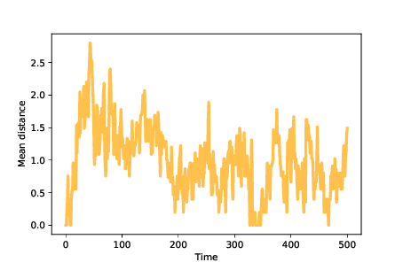

Speciation
---------------

.. _12.10:

The theory of evolution says that natural selection changes existing species and creates new ones. In our model, we have seen changes, but we have not seen a new species. It’s not even clear, in the model, what a new species would look like.

Among species that reproduce sexually, two organisms are considered the same species if they can breed and produce fertile offspring. But the agents in the model don’t reproduce sexually, so this definition doesn’t apply.

Among organisms that reproduce asexually, like bacteria, the definition of species is not as clear-cut. Generally, a population is considered a species if their genotypes form a cluster, that is, if the genetic differences within the population are small compared to the differences between populations.

Before we can model new species, we need the ability to identify clusters of agents in the landscape, which means we need a definition of **distance** between locations. Since locations are represented with arrays of bits, we’ll define distance as the number of bits that differ between locations. ``FitnessLandscape`` provides a distance method:

.. _mean_dis_over_time:

::

    # class FitnessLandscape

        def distance(self, loc1, loc2):
            return np.sum(np.logical_xor(loc1, loc2))

    Figure 12.5: Mean distance between agents over time.

The ``logical_xor`` function computes “exclusive OR", which is ``True`` for bits that differ, and ``False`` for the bits that are the same.

To quantify the dispersion of a population, we can compute the mean of the distances between pairs of agents. In the notebook for this chapter, you’ll see the ``MeanDistance`` instrument, which computes this metric after each time step.

:ref:`Figure 12.5 <mean_dis_over_time>` shows mean distance between agents over time. Because we start with identical mutants, the initial distances are 0. As mutations occur, mean distance increases, reaching a maximum while the population migrates across the landscape.

Once the agents discover the optimal location, mean distance decreases until the population reaches an equilibrium where increasing distance due to mutation is balanced by decreasing distance as agents far from the optimal location disappear. In these simulations, the mean distance in equilibrium is near 1; that is, most agents are only one mutation away from optimal.

Now we are ready to look for new species. To model a simple kind of speciation, suppose a population evolves in an unchanging environment until it reaches steady state (like some species we find in nature that seem to have changed very little over long periods of time).

Now suppose we either change the environment or transport the population to a new environment. Some features that increased fitness in the old environment might decrease it in the new environment, and vice versa.

We can model these scenarios by running a simulation until the population reaches steady state, then changing the fitness landscape, and then resuming the simulation until the population reaches steady state again.

.. _mean_dis_over_time_2:

.. figure:: Figures/figure_12.6.png
    :align: center
    :alt: " Figure 12.6: Mean fitness over time. After 500 time steps, we change the fitness landscape."

    Figure 12.6: Mean fitness over time. After 500 time steps, we change the fitness landscape.

:ref:`Figure 12.6 <mean_dis_over_time_2>` shows results from a simulation like that. We start with 100 identical mutants at a random location, and run the simulation for 500 time steps. At that point, many agents are at the optimal location, which has fitness near 0.65 in this example. The genotypes of the agents form a cluster, with the mean distance between agents near 1.

After 500 steps, we run ``FitnessLandscape.set_values``, which changes the fitness landscape; then we resume the simulation. Mean fitness is lower, as we expect because the optimal location in the old landscape is no better than a random location in the new landscape.

After the change, mean fitness increases again as the population migrates across the new landscape, eventually finding the new optimum, which has fitness near 0.75 (which happens to be higher in this example, but needn’t be).

Once the population reaches steady state, it forms a new cluster, with mean distance between agents near 1 again.

Now if we compute the distance between the agents’ locations before and after the change, they differ by more than 6, on average. The distances between clusters are much bigger than the distances between agents in each cluster, so we can interpret these clusters as distinct species.

