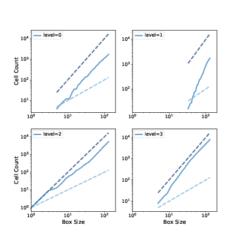

Fractals
--------

.. _9.6:

Another property of critical systems is fractal geometry. The initial configuration in Figure ?? (left) resembles a fractal, but you can’t always tell by looking. A more reliable way to identify a fractal is to estimate its fractal dimension, as we saw in :ref:`Section 8.6<8.6>` and :ref:`Section 8.7<8.7>`.

I’ll start by making a bigger sand pile, with ``n=131`` and initial level ``22``.

::

    pile3 = SandPile(n=131, level=22)
    pile3.run()

It takes 28,379 steps for this pile to reach equilibrium, with more than 200 million cells toppled.

To see the resulting pattern more clearly, I select cells with levels 0, 1, 2, and 3, and plot them separately:

::

    def draw_four(viewer, levels=range(4)):
        thinkplot.preplot(rows=2, cols=2)
        a = viewer.viewee.array

        for i, level in enumerate(levels):
            thinkplot.subplot(i+1)
            viewer.draw_array(a==level, vmax=1)

``draw_four`` takes a ``SandPileViewer`` object, which is defined in ``Sand.py`` in the repository for this book. The parameter ``levels`` is the list of levels we want to plot; the default is the range 0 through 3. If the sand pile has run until equilibrium, these are the only levels that should exist.

Inside the loop, it uses ``a==level`` to make a boolean array that’s ``True`` where the array is ``level`` and ``False`` otherwise. ``draw_array`` treats these booleans as 1s and 0s.

.. figure:: Figures/figure_9.4.png
    :align: center
    :alt: "Figure 9.4: Sand pile model in equilibrium, selecting cells with levels 0, 1, 2, and 3, left to right, top to bottom."

    Figure 9.4: Sand pile model in equilibrium, selecting cells with levels 0, 1, 2, and 3, left to right, top to bottom.

Figure ?? shows the results for pile3. Visually, these patterns resemble fractals, but looks can be deceiving. To be more confident, we can estimate the fractal dimension for each pattern using **box-counting**, as we saw in :ref:`Section 8.6<8.6>`.

We’ll count the number of cells in a small box at the center of the pile, then see how the number of cells increases as the box gets bigger. Here’s my implementation:

::

    def count_cells(a):
    n, m = a.shape
    end = min(n, m)

    res = []
    for i in range(1, end, 2):
        top = (n-i) // 2
        left = (m-i) // 2
        box = a[top:top+i, left:left+i]
        total = np.sum(box)
        res.append((i, i**2, total))

    return np.transpose(res)

The parameter, a, is a boolean array. The size of the box is initially 1. Each time through the loop, it increases by 2 until it reaches ``end``, which is the smaller of ``n`` and ``m``.

Each time through the loop, ``box`` is a set of cells with width and height ``i``, centered in the array. ``total`` is the number of “on” cells in the box.

The result is a list of tuples, where each tuple contains ``i``,`` i**2``, and the number of cells in the box. 
When we pass this result to ``transpose``, NumPy converts it to an array with three columns, and then transposes it; that is, it makes the columns into rows and the rows into columns. The result is an array with 3 rows: ``i``, ``i**2``, and ``total``.

Here’s how we use ``count_cells``:

::

    res = count_cells(pile.array==level)
    steps, steps2, cells = res

The first line creates a boolean array that contains ``True`` where the array equals ``level``, calls ``count_cells``, and gets an array with three rows.

The second line unpacks the rows and assigns them to ``steps``, ``steps2``, and ``cells``, which we can plot like this:

::

    thinkplot.plot(steps, steps2, linestyle='dashed')
    thinkplot.plot(steps, cells)
    thinkplot.plot(steps, steps, linestyle='dashed')

    Figure 9.5: Box counts for cells with levels 0, 1, 2, and 3, compared to dashed lines with slopes 1 and 2.

Figure ?? shows the results. On a log-log scale, the cell counts form nearly straight lines, which indicates that we are measuring fractal dimension over a valid range of box sizes.

To estimate the slopes of these lines, we can use the SciPy function ``linregress``, which fits a line to the data by linear regression (see http://thinkcomplex.com/regress).

::

    from scipy.stats import linregress

    params = linregress(np.log(steps), np.log(cells))
    slope = params[0]

The estimated fractal dimensions are:

::
        
    0  1.871
    1  3.502
    2  1.781
    3  2.084

The fractal dimension for levels 0, 1, and 2 seems to be clearly non-integer, which indicates that the image is fractal.

The estimate for level 3 is indistinguishable from 2, but given the results for the other values, the apparent curvature of the line, and the appearance of the pattern, it seems likely that it is also fractal.

One of the exercises in the notebook for this chapter asks you to run this analysis again with different values of ``n`` and the initial ``level`` to see if the estimated dimensions are consistent.