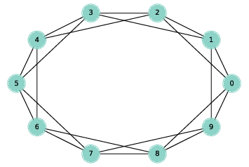

.. _fig_4.1:

Ring lattice
------------

.. _fig_cpp_reference:

   Figure 4.1: A ring lattice with n=10 and k=4.

A **regular** graph is a graph where each node has the same number of neighbors; the number of neighbors is also called the **degree** of the node.

A ring lattice is a kind of regular graph, which Watts and Strogatz use as the basis of their model. In a ring lattice with n nodes, the nodes can be arranged in a circle with each node connected to the k nearest neighbors.

For example, a ring lattice with n=3 and k=2 would contain the following edges: (0, 1), (1, 2), and (2, 0). Notice that the edges “wrap around” from the highest-numbered node back to 0.

More generally, we can enumerate the edges like this:

::

    def adjacent_edges(nodes, halfk):
    n = len(nodes)
    for i, u in enumerate(nodes):
        for j in range(i+1, i+halfk+1):
            v = nodes[j % n]
            yield u, v

``adjacent_edges`` takes a list of nodes and a parameter, ``halfk``, which is half of k. It is a generator function that yields one edge at a time. It uses the modulus operator, %, to wrap around from the highest-numbered node to the lowest.

We can test it like this:

::

    >>> nodes = range(3)
    >>> for edge in adjacent_edges(nodes, 1):
    ...     print(edge)
    (0, 1)
    (1, 2)
    (2, 0)

Now we can use ``adjacent_edges`` to make a ring lattice:

::

    def make_ring_lattice(n, k):
    G = nx.Graph()
    nodes = range(n)
    G.add_nodes_from(nodes)
    G.add_edges_from(adjacent_edges(nodes, k//2))
    return G

Notice that ``make_ring_lattice`` uses floor division to compute ``halfk``, so it is only correct if k is even. If k is odd, floor division rounds down, so the result is a ring lattice with degree k-1. As one of the exercises at the end of the chapter, you will generate regular graphs with odd values of k.

We can test ``make_ring_lattice`` like this:

::

    lattice = make_ring_lattice(10, 4)

:ref:`Figure 4.1 <fig_4.1>` shows the result.

.. fillintheblank:: question_4.4.1
        :casei:

        |blank| is a graph with n nodes, the nodes can be arranged in a circle with each node connected to the k nearest neighbors.
 
        - :ring lattice: Correct.
          :WS graphs: Incorrect. WS graphs in the book refer to the Watts-Strogatz model that is based on a random graph generation model which produces graphs with small-world properties.
          :Regular graph: Incorrect. A regular graph is a graph where each node has the same number of neighbors. This graph is a kind of regular graph. Please try again.
          :x: Try again.

