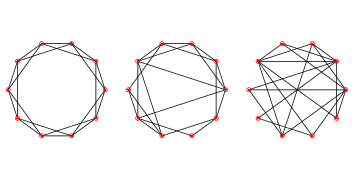

.. _fig_4.2:

WS graphs
---------

.. _fig_cpp_reference:

   Figure 4.2: WS graphs with n=20, k=4, and p=0 (left), p=0.2 (middle), and p=1 (right).

To make a Watts-Strogatz (WS) graph, we start with a ring lattice and “rewire” some of the edges. In their paper, Watts and Strogatz consider the edges in a particular order and rewire each one with probability p. If an edge is rewired, they leave the first node unchanged and choose the second node at random. They don’t allow self loops or multiple edges; that is, you can’t have a edge from a node to itself, and you can’t have more than one edge between the same two nodes.

Here is my implementation of this process.

::

    def rewire(G, p):
    nodes = set(G)
    for u, v in G.edges():
        if flip(p):
            choices = nodes - {u} - set(G[u])
            new_v = np.random.choice(list(choices))
            G.remove_edge(u, v)
            G.add_edge(u, new_v)

The parameter p is the probability of rewiring an edge. The for loop enumerates the edges and uses ``flip`` (defined in :ref:`Section 3.7 <3.7>`) to choose which ones get rewired.

If we are rewiring an edge from node ``u`` to node ``v``, we have to choose a replacement for ``v``, called ``new_v``.

1. To compute the possible choices, we start with ``nodes``, which is a set, and subtract off u and its neighbors, which avoids self loops and multiple edges.
2. To choose ``new_v``, we use the NumPy function ``choice``, which is in the module random.
3. Then we remove the existing edge from ``u`` to ``v``, and
4. Add a new edge from u to ``new_v``.

As an aside, the expression ``G[u]`` returns a dictionary that contains the neighbors of u as keys. It is usually faster than using ``G.neighbors`` (see http://thinkcomplex.com/neigh).

This function does not consider the edges in the order specified by Watts and Strogatz, but that doesn’t seem to affect the results.

:ref:`Figure 4.2 <fig_4.2>` shows WS graphs with n=20, k=4, and a range of values of p. When p=0, the graph is a ring lattice. When p=1, it is completely random. As we’ll see, the interesting things happen in between.