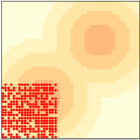

.. _wavey_boi:

Migration and Wave Behavior
----------------------------

.. figure:: Figures/figure_10.5.png
    :align: center
    :alt: "Figure 10.5: Wave behavior in Sugarscape: initial configuration (left), after 6 steps (middle) and after 12 steps (right)."

    Figure 10.5: Wave behavior in Sugarscape: initial configuration (left), after 6 steps (middle) and after 12 steps (right).

Although the purpose of Sugarscape is not primarily to explore the movement of agents in space, Epstein and Axtell observed some interesting patterns when agents migrate.

If we start with all agents in the lower-left corner, they quickly move toward the closest “peak” of high-capacity cells. But if there are more agents than a single peak can support, they quickly exhaust the sugar and agents are forced to move into lower-capacity areas.

The ones with the longest vision cross the valley between the peaks and propagate toward the northeast in a pattern that resembles a wave front. Because they leave a stripe of empty cells behind them, other agents don’t follow until the sugar grows back.

The result is a series of discrete waves of migration, where each wave resembles a coherent object, like the spaceships we saw in the Rule 110 CA and Game of Life (see :ref:`Section 6.6 <6.6>` and :ref:`Section 7.3 <7.3>`).

:ref:`Figure 10.5 <wavey_boi>`  shows the initial condition (left) and the state of the model after 6 steps (middle) and 12 steps (right). You can see the first two waves reaching and moving through the second peak, leaving a stripe of empty cells behind. You can see an animated version of this model, where the wave patterns are more clearly visible, in the notebook for this chapter.

These waves move diagonally, which is surprising because the agents themselves only move north or east, never northeast. Outcomes like this — groups or “aggregates” with properties and behaviors that the agents don’t have — are common in agent-based models. We will see more examples in the next chapter.

    Gif 10.2: Wave behavior in a sugarscape. 