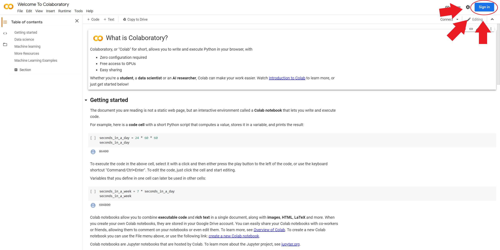
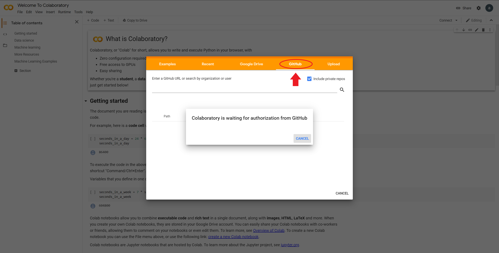
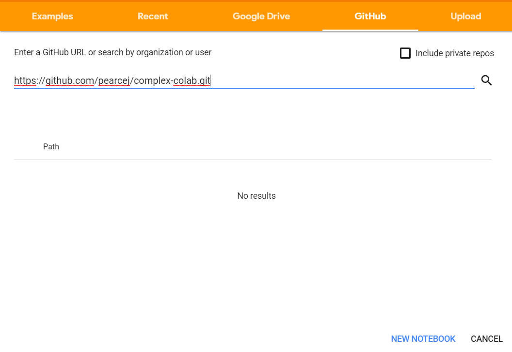
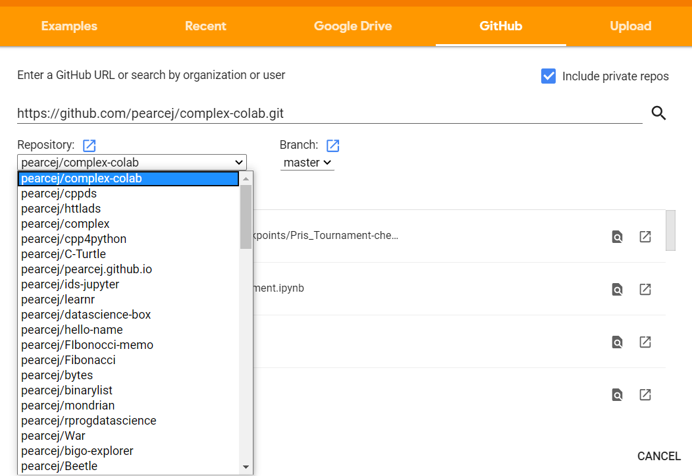
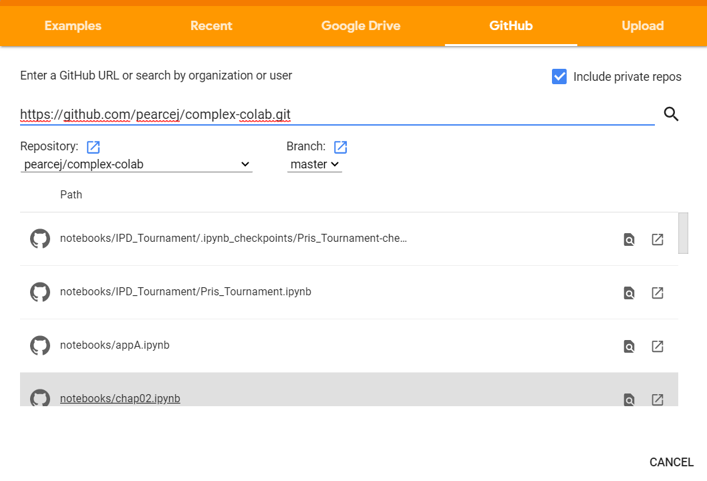

.. _Ap_2:

Getting Started With Google Colab
----------------------------------

Follow these guidelines on how to use colab to view the jupyter notebooks without installing Anaconda.

1. Go to this link https://colab.research.google.com/

- If you are already signed in to a google account skip to step 4.

2. Once the page with Welcome to Colabatory opens press the blue Sign In button in the top right corner of the screen.

   
   Figure 1: Sign in button.

3. Sign into your Gmail account as you would normally. 

4. A box with an orange overlay should appear, please select the tab that says Github.

   
   Figure 2: Pop up after sign in.

- If the box doesn’t appear go to file and click open notebook. **Do not click on new notebook**.

.. figure:: Figures/File.png
   :align: center
   :alt: "Opening a notebook through file."
  
   Figure 3: Opening a notebook through file.

- If you are trying to access a private repository be sure to check the box in the top right corner to include private repositories.

- If you are trying to access a private repository you will need to sign into your github account.

.. figure:: Figures/Github_authorization.png
   :align: center
   :alt: "The github authorization pop up."
   
   Figure 4: The github authorization pop up.

5. Please enter the following URL in the blank provided: https://github.com/pearcej/complex-colab.git

   
   Figure 5: Link for repo. 

6. Hit enter or click beside the word path. It may take a moment to think but a menu should appear below.

7. There should be a drop down box right underneath the line that you just put the URL in. Open the drop down box and find the complex-colab repository and click on it to open.

   
   Figure 6: Repo drop down menu.

- If the Repo dosen't show up the first time you might have to close the tab and reopen google colab.

8. Scroll and find the jupyter notebook that needs to be opened.

   
   Figure 7: List of the notebooks.

This should get you to the point where you can start to explore colab and use it for class and homework.

.. figure:: Figures/opened_repo.png
   :align: center
   :alt: "Chapter 2 notebook opened up."
   
   Figure 8: Chapter 2 notebook opened up.
