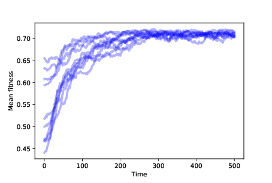

Mutation
--------------

In the simulations so far, we start with the maximum possible diversity — one agent at every location in the landscape — and end with the minimum possible diversity, all agents at one location.

That’s almost the opposite of what happened in the natural world, which apparently began with a single species that branched, over time, into the millions, or possibly billions, of species on Earth today.

With perfect copying in our model, we never see increasing diversity. But if we add mutation, along with differential survival and reproduction, we get a step closer to understanding evolution in nature.

Here is a class definition that extends ``Agent`` and overrides ``copy``:

::

    class Mutant(Agent):

        def copy(self, prob_mutate=0.05)::
            if np.random.random() > prob_mutate:
                loc = self.loc.copy()
            else:
                direction = np.random.randint(self.fit_land.N)
                loc = self.mutate(direction)
            return Mutant(loc, self.fit_land)

In this model of mutation, every time we call ``copy``, there is a 5% chance of mutation. In case of mutation, we choose a random direction from the current location — that is, a random bit in the genotype — and flip it. Here’s ``mutate``:

::

    def mutate(self, direction):
        new_loc = self.loc.copy()
        new_loc[direction] ^= 1
        return new_loc

.. _mean_fig_over_time:

The operator ^= computes “exclusive OR"; with the operand 1, it has the effect of flipping a bit.

Now that we have mutation, we don’t have to start with an agent at every location. Instead, we can start with the minimum variability: all agents at the same location.

    Figure 12.3: Mean fitness over time for 10 simulations with mutation and differential survival and reproduction.

   

:ref:`Figure 12.3 <mean_fig_over_time>` shows the results of 10 simulations with mutation and differential survival and reproduction. In every case, the population evolves toward the location with maximum fitness.

.. _num_oc:

.. figure:: Figures/figure_12.4.png
    :align: center
    :alt: "Figure 12.4: Number of occupied locations over time for 10 simulations with mutation and differential survival and reproduction."

    Figure 12.4: Number of occupied locations over time for 10 simulations with mutation and differential survival and reproduction.

To measure diversity in the population, we can plot the number of occupied locations after each time step. :ref:`Figure 12.4 <num_oc>` shows the results. We start with 100 agents at the same location. As mutations occur, the number of occupied locations increases quickly.

When an agent discovers a high-fitness location, it is more likely to survive and reproduce. Agents at lower-fitness locations eventually die out. Over time, the population migrates through the landscape until most agents are at the location with the highest fitness.

At that point, the system reaches an equilibrium where mutation occupies new locations at the same rate that differential survival causes lower-fitness locations to be left empty.

The number of occupied locations in equilibrium depends on the mutation rate and the degree of differential survival. In these simulations the number of unique occupied locations at any point is typically 5–15.

It is important to remember that the agents in this model don’t move, just as the genotype of an organism doesn’t change. When an agent dies, it can leave a location unoccupied. And when a mutation occurs, it can occupy a new location. As agents disappear from some locations and appear in others, the population migrates across the landscape, like a glider in Game of Life. But organisms don’t evolve; populations do.

.. mchoice:: CH12.9_Q1
    :answer_a: True
    :answer_b: False
    :correct: b
    :feedback_a: Incorrect, the agents actually need to be in the same location once mutation is implemented. 
    :feedback_b: Correct, agents will all start in the same location when we have mutation.

    All the agents start in the same location until we add in mutation then they start at every location across the landscape to increase the diversity of agents.