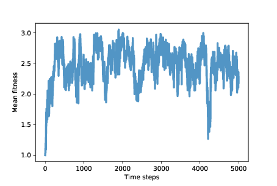

Results
-------------
Suppose we start with a population of three agents: one always cooperates, one always defects, and one plays the TFT strategy. If we run ``Tournament.melee`` with this population, the cooperator gets 1.5 points per round, the TFT agent gets 1.9, and the defector gets 3.33. This result suggests that “always defect" should quickly become the dominant strategy.

But “always defect" contains the seeds of its own destruction. If nicer strategies are driven to extinction, the defectors have no one to take advantage of. Their fitness drops, and they become vulnerable to invasion by cooperators.

Based on this analysis, it is not easy to predict how the system will behave: will it find a stable equilibrium, or oscillate between various points in the genotype landscape? Let’s run the simulation and find out!

I start with 100 identical agents who always defect, and run the simulation for 5000 steps:

.. _fig_avg_fit:

::

    tour = Tournament()
    agents = make_identical_agents(100, list('DDDDDDD'))
    sim = PDSimulation(tour, agents)

    Figure 13.1: Average fitness (points scored per round of Prisoner’s Dilemma)

   

:ref:`Figure 13.1 <fig_avg_fit>` shows mean fitness over time (using the ``MeanFitness`` instrument from :ref:`Section 12.7 <12.7>`). Initially mean fitness is 1, because when defectors face each other, they get only 1 point each per round.

After about 500 time steps, mean fitness increases to nearly 3, which is what cooperators get when they face each other. However, as we suspected, this situation in unstable. Over the next 500 steps, mean fitness drops below 2, climbs back toward 3, and continues to oscillate.

The rest of the simulation is highly variable, but with the exception of one big drop, mean fitness is usually between 2 and 3, with the long-term mean close to 2.5.

And that’s not bad! It’s not quite a utopia of cooperation, which would average 3 points per round, but it’s a long way from the dystopia of perpetual defection. And it’s a lot better than what we might expect from the natural selection of self-interested agents.

To get some insight into this level of fitness, let’s look at a few more ``instruments``. ``Niceness`` measures the fraction of cooperation in the genotypes of the agents after each time step:

.. _fig_avg_nice:

::

    class Niceness(Instrument):

        def update(self, sim):
            responses = np.array([agent.values
                                for agent in sim.agents])
            metric = np.mean(responses == 'C')
            self.metrics.append(metric)

``responses`` is an array with one row for each agent and one column for each element of the genome. ``metric`` is the fraction of elements that are 'C', averaged across agents.

.. figure:: Figures/figure_13.2.png
    :align: center
    :alt: "Figure 13.2: Average niceness across all genomes in the population (left), and fraction of population that cooperates in the first round (right)."

    Figure 13.2: Average niceness across all genomes in the population (left), and fraction of population that cooperates in the first round (right).

:ref:`Figure 13.2 <fig_avg_nice>` (left) shows the results: starting from 0, average niceness increases quickly to 0.75, then oscillates between 0.4 and 0.85, with a long-term mean near 0.65. Again, that’s a lot of niceness!

Looking specifically at the opening move, we can track the fraction of agents that cooperate in the first round. Here’s the ``instrument``:

::

    class Opening(Instrument):

        def update(self, sim):
            responses = np.array([agent.values[0]
                                for agent in sim.agents])
            metric = np.mean(responses == 'C')
            self.metrics.append(metric)

:ref:`Figure 13.2 <fig_avg_nice>` (right) shows the results, which are highly variable. The fraction of agents who cooperate in the first round is often near 1, and occasionally near 0. The long-term average is close to 0.65, similar to overall niceness. These results are consistent with Axelrod’s tournaments; in general, nice strategies do well.

The other characteristics Axelrod identifies in successful strategies are retaliation and forgiveness. To measure retaliation, I define this ``instrument``:

::

    class Retaliating(Instrument):

        def update(self, sim):
            after_d = np.array([agent.values[2::2]
                                for agent in sim.agents])
            after_c = np.array([agent.values[1::2]
                                for agent in sim.agents])
            metric = np.mean(after_d=='D') - np.mean(after_c=='D')

``Retaliating`` compares the number of elements in all genomes where an agent defects after the opponent defects (elements 2, 4, and 6) with the number of places where an agents defects after the opponent cooperates. As you might expect by now, the results vary substantially (you can see the graph in the notebook). On average the difference between these fractions is less than 0.1, so if agents defect 30% of the time after the opponent cooperates, they might defect 40% of the time after a defection.

This result provides weak support for the claim that successful strategies retaliate. But maybe it’s not necessary for all agents, or even many, to be retaliatory; if there is at least some tendency toward retaliation in the population as a whole, that might be enough to prevent high-defection strategies from gaining ground.

To measure forgiveness, I define one more ``instrument`` to see whether agents might be more likely to cooperate after D-C in the previous two rounds, compared to C-D. In my simulations, there is no evidence for this particular kind of forgiveness. On the other hand, the strategies in these simulations are necessarily forgiving because they consider only the previous two rounds of history. In this context, forgetting is a kind of forgiving.

.. mchoice:: Ch13.8_Q1
    :answer_a: 4 rounds
    :answer_b: 1 round
    :answer_c: 2 rounds
    :answer_d: It takes all of the rounds into consideration. 
    :correct_: c
    :feedback_a: Incorrect, please look at the amount of rounds again.
    :feedback_b: Incorrect, please look at the amount of rounds again.
    :feedback_c: Correct, they only base their decisions based on the previous two rounds.
    :feedback_d: Incorrect, there is a number of rounds after which the strategies "forget" about what happened.

    How many rounds do the strategies in these simulations take into consideration when choosing weather to cooperate or defect?