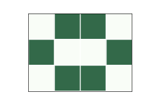

.. _7.1:

Life Pattern
-------------

    Figure 7.1: A stable pattern called a beehive.

.. _fig7.2:

.. figure:: Figures/figure_7.2.png
    :align: center
    :alt: "Figure 7.2: An oscillator called a toad."

    Figure 7.2: An oscillator called a toad.

.. _7.3:

.. figure:: Figures/figure_7.3.png
    :align: center
    :alt: "Figure 7.3: A spaceship called a glider."

    Figure 7.3: A spaceship called a glider.

If you run GoL from a random starting state, a number of stable patterns are likely to appear. Over time, people have identified these patterns and given them names.

For example, :ref:`Figure 7.1 <7.1>`  shows a stable pattern called a “beehive”. Every cell in the beehive has 2 or 3 neighbors, so they all survive, and none of the dead cells adjacent to the beehive has 3 neighbors, so no new cells are born.

Other patterns “oscillate”; that is, they change over time but eventually return to their starting configuration (provided they don’t collide with another pattern). For example, :ref:`Figure 7.2 <7.2>` shows a pattern called a “toad”, which is an oscillator that alternates between two states. The “period” of this oscillator is 2.

Finally, some patterns oscillate and return to the starting configuration, but shifted in space. Because these patterns seem to move, they are called “spaceships”.

:ref:`Figure 7.3 <7.3>` shows a spaceship called a “glider”. After a period of 4 steps, the glider is back in the starting configuration, shifted one unit down and to the right.

Depending on the starting orientation, gliders can move along any of the four diagonals. There are other spaceships that move horizontally and vertically.

People have spent embarrassing amounts of time finding and naming these patterns. If you search the web, you will find many collections.

.. dragndrop:: q_7.3
   :match_1: Beehive|||This pattern changes over time but eventually returns to its starting configuration.
   :match_2: Toad|||In this pattern, cells have 2 or 3 neighbors, so they all survive, and none of the dead cells adjacent to the pattern has 3 neighbors, so no new cells are born
   :match_3: Glider|||This pattern oscillates and returns to the starting configuration, but shifts in space.

   Match the GoL patterns to their properties:

.. mchoice:: q_7.4
   :answer_a: True
   :answer_b: False
   :correct: b
   :feedback_a: Sorry but a number of stable patterns are likely to appear if you run a GoL from a random starting state
   :feedback_b: Correct!

   If you run a GoL from a random starting state, a number of unstable patterns are likely to appear.

.. shortanswer:: q_7.5
   
   Why do you think that people are fascinated with this kind of program so much that they name the formations?
