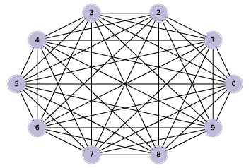

..  Copyright (C)  Jan Pearce
    This work is licensed under the Creative Commons Attribution-NonCommercial-ShareAlike 4.0 International License. To view a copy of this license, visit http://creativecommons.org/licenses/by-nc-sa/4.0/.

.. _G_FIG_3:

Generating Graphs
-----------------

.. _fig_cpp_reference:

   Figure 4.3: A complete graph with 10 nodes.

I’ll start by generating a **complete graph**, which is a graph where every node is connected to every other.

Here’s a generator function that takes a list of nodes and enumerates all distinct pairs. If you are not familiar with generator functions.

::

    def all_pairs(nodes):
    for i, u in enumerate(nodes):
        for j, v in enumerate(nodes):
            if i>j:
                yield u, v

We can use ``all_pairs`` to construct a complete graph:

::

    def make_complete_graph(n):
        G = nx.Graph()
        nodes = range(n)
        G.add_nodes_from(nodes)
        G.add_edges_from(all_pairs(nodes))
        return G

``make_complete_graph`` takes the number of nodes, ``n``, and returns a new ``Graph`` with ``n`` nodes and edges between all pairs of nodes.

The following code makes a complete graph with 10 nodes and draws it:

::

    complete = make_complete_graph(10)
    nx.draw_circular(complete,
                 node_color=COLORS[2],
                 node_size=1000,
                 with_labels=True)

:ref:`Figure 4.3 <G_FIG_3>` shows the result. Soon we will modify this code to generate ER graphs, but first we’ll develop functions to check whether a graph is connected.
