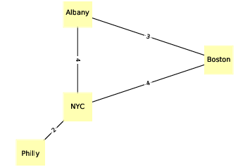

.. _G_3:
.. _G_FIG_2:

NetworkX
---------

   Figure 4.2: An undirected graph that represents driving time between cities.

To represent graphs, we’ll use a package called NetworkX, which is the most commonly used network library in Python. 

We can create a directed graph by importing NetworkX (usually imported as ``nx``) and instantiating ``nx.DiGraph``:

::

     import networkx as nx
     G = nx.DiGraph()

At this point, ``G`` is a ``DiGraph`` object that contains no nodes and no edges. We can add nodes using the ``add_node`` method:

::

    G.add_node('Alice')
    G.add_node('Bob')
    G.add_node('Chuck')

Now we can use the ``nodes`` method to get a list of nodes:

::

    (G.nodes())
    NodeView(('Alice', 'Bob', 'Chuck'))

The ``nodes`` method returns a ``NodeView``, which can be used in a for loop or, as in this example, used to make a list.

Adding edges works pretty much the same way:
:: 
    
    G.add_edge('Alice', 'Bob')
    G.add_edge('Alice', 'Chuck')
    G.add_edge('Bob', 'Alice')
    G.add_edge('Bob', 'Chuck')

And we can use ``edges`` to get the list of edges:

::
    
    (G.edges())
    [('Alice', 'Bob'), ('Alice', 'Chuck'),
    ('Bob', 'Alice'), ('Bob', 'Chuck')]

NetworkX provides several functions for drawing graphs; ``draw_circular`` arranges the nodes in a circle and connects them with edges:

::

    (nx.draw_circular(G,
                 node_color=COLORS[0],
                 node_size=2000,
                 with_labels=True)

That’s the code I use to generate :ref:`Figure 4.1 <G_FIG_1>`. The option ``with_labels`` causes the nodes to be labeled; in the next example we’ll see how to label the edges.

To generate :ref:`Figure 4.2 <G_FIG_2>`, I start with a dictionary that maps from each city name to its approximate longitude and latitude:

::

     positions = dict(Albany=(-74, 43),
                 Boston=(-71, 42),
                 NYC=(-74, 41),
                 Philly=(-75, 40))

Since this is an undirected graph, I instantiate ``nx.Graph``:

::

     G = nx.Graph()

Then I can use ``add_nodes_from`` to iterate the keys of ``positions`` and add them as nodes:

::

     G.add_nodes_from(positions)

Next I’ll make a dictionary that maps from each edge to the corresponding driving time:

::

     drive_times = {('Albany', 'Boston'): 3,
               ('Albany', 'NYC'): 4,
               ('Boston', 'NYC'): 4,
               ('NYC', 'Philly'): 2}

Now I can use ``add_edges_from``, which iterates the keys of ``drive_times`` and adds them as edges:

::

     G.add_edges_from(drive_times)

Instead of ``draw_circular``, which arranges the nodes in a circle, I’ll use ``draw``, which takes the position dictionary as the second parameter:

::  

     nx.draw(G, positions,
        node_color=COLORS[1],
        node_shape='s',
        node_size=2500,
        with_labels=True)

``draw`` uses ``positions`` to determine the locations of the nodes.

To add the edge labels, we use ``draw_networkx_edge_labels``:

::

     x.draw_networkx_edge_labels(G, positions,
                             edge_labels=drive_times)

The ``edge_labels`` parameter expects a dictionary that maps from each pair of nodes to a label; in this case, the labels are driving times between cities. And that’s how I generated :ref:`Figure 4.2 <G_FIG_2>`.

In both of these examples, the nodes are strings, but in general they can be any hashable type.

.. dragndrop:: Q2_3.3
     :match_1: Positions|||A dictionary that maps from each city name to its approximate longitude and latitude.
     :match_2: Add_nodes_from|||This is a method that iterates through the keys of positions and adds them as nodes.
     :match_3: Drive_times|||A dictionary that maps from each edge to the corresponding driving time.
     :match_4: Add_edges_from|||This method iterates the keys of drive_times and adds them as edges.
     :match_5: Draw|||Takes the position dictionary as the second parameter, and uses positions to determine the locations of the nodes.
     :match_6: Draw_networkx_edge_labels|||This method adds edge labels.
     :match_7: edge_labels|||This parameter expects a dictionary that maps from each pair of nodes to a label; in this case, the labels are driving times between cities.